# PULSE / OPS

서버·DB·Redis·HTTP·애플리케이션 상태와 장애 알림을 한 화면에서 관리하는 대시보드입니다. **Go 서비스 하나 + SQLite**로 동작하며 별도 프런트 빌드가 없습니다.

## 주요 기능

- **통합 대시보드** — 여러 서버의 자원, 요청량·오류율·응답시간, DB·Redis 지표를 함께 확인합니다.
- **인프라 관리** — 연결 정보 등록, CSV 일괄 등록, 연결 진단과 SSH 터미널을 제공합니다.
- **장애 관리** — 이벤트 발생·복구, 처리 상태·메모, 점검 시간을 관리합니다.
- **알림 연동** — 웹훅·Slack·Discord·Teams로 알림과 일간·주간 요약을 보냅니다.

## 빠른 시작

Git과 Docker Compose가 설치된 환경에서 실행합니다.

```sh
git clone https://github.com/qmdch1/pulse-ops.git
cd pulse-ops
mkdir -p .local/ssh
docker compose -f compose.test.yml --profile dashboard up -d --build
```

[localhost:13000](http://localhost:13000)에 접속하면 테스트 인프라가 자동 등록됩니다. 이 구성은 로컬 테스트용이며, 실제 서버 운영은 [운영 배포 안내](docs/setup.md#운영-배포)를 따릅니다.

인프라는 등록 후 **연결 시작**, 알림은 환경설정에서 **테스트 전송 → 자동 알림 활성화**를 선택합니다. 앱의 오류율·P99는 각 인스턴스에 [`/metrics` 계측](docs/application-metrics.md)이 필요합니다.

## Cloudflare DNS·프록시 구성 예시

**서비스 요청** · 접속·캐시 → API·DB → 오류 응답

<picture>
  <source media="(prefers-color-scheme: dark)" srcset="docs/images/cloudflare-traffic-flow-dark.svg">
  
</picture>

**운영 관측** · 지표 수집 → 통합 화면

<picture>
  <source media="(prefers-color-scheme: dark)" srcset="docs/images/pulse-observation-flow-dark.svg">
  
</picture>

Cloudflare·Nginx를 사용하는 배치 예시입니다. **수치는 가상값이며, Cloudflare API 연결은 연동 예정**입니다. [구조·수집 방식 자세히 보기](docs/architecture.md)

## 상세 문서

| 필요한 내용 | 문서 |
| --- | --- |
| 설치·운영 배포·개발 | [설치 안내](docs/setup.md) |
| 인프라 연결·그래프·메신저 설정 | [사용 가이드](docs/user-guide.md) |
| 앱 요청량·오류율·P99 계측 | [애플리케이션 계측](docs/application-metrics.md) |
| 검증 범위·운영 과제 | [검증 기록](docs/native-web-verification.md) · [운영 과제](docs/production-readiness.md) · [코드 검토](docs/code-review.md) |
