# PULSE / OPS

등록한 서버·DB·캐시·애플리케이션을 직접 연결해 관측하는 대시보드입니다. **Go 단일 서비스 + HTML/CSS/JavaScript**로 동작합니다. 실행·빌드에 Node, npm, React, Next, 번들러가 필요하지 않습니다.

## 구조

<picture>
  <source media="(prefers-color-scheme: dark)" srcset="docs/images/architecture-flow-dark.svg">
  
</picture>

애니메이션은 네 경로를 한 장면씩 보여 줍니다. 실제로는 각 경로가 서로 독립적으로 동시에 동작하고, 점의 속도는 실제 지연이나 처리량이 아닙니다. 운영체제의 ‘동작 줄이기’ 설정을 켜면 정지된 구조도만 표시합니다.

1. **화면 로드**: 브라우저가 Go에서 HTML, CSS, 네이티브 ES 모듈을 받습니다. 파일은 실행 파일에 포함되며 gzip·ETag로 전달합니다.
2. **화면 갱신**: 브라우저 Worker가 같은 출처의 `/api/monitoring`에서 관측값을 읽고 이벤트 규칙을 평가합니다. 3초 안에 들어온 같은 범위·대상 조회는 공유 캐시로 응답하며, 화면 갱신은 수집을 호출하지 않습니다. 화면은 Canvas로 필요한 그래프를 그립니다.
3. **수집**: Go 수집기는 화면 요청과 독립적으로 15초마다 실행합니다. 동시 수집은 최대 4개이고 등록 ID마다 하나씩만 진행합니다. 슬롯이 모두 차면 다음 대상은 빈 슬롯을 기다립니다. 등록한 SSH·DB·Redis·HTTP·애플리케이션에 직접 접근하고 결과를 SQLite에 저장합니다.
4. **터미널**: 터미널을 열 때만 내장된 xterm 파일을 읽습니다. 30초 단회 티켓 → WebSocket → Go SSH PTY 경로로 실제 셸을 연결합니다. 감사 기록에는 연결·종료만 남기고 입력·출력 본문은 보관하지 않습니다.
5. **저장**: 등록 정보는 AES-256-GCM으로 암호화하고 관측·감사 기록은 같은 SQLite 볼륨에 저장합니다. 관측 보존은 15일, 감사 보존은 90일입니다.

HTTPS는 Go의 인증서 설정 또는 이미 운영하는 HTTPS 앞단을 사용합니다. 애플리케이션 자체에 별도 Nginx·Node 컨테이너는 필요하지 않습니다. Prometheus/Grafana는 선택적 분석 도구이며 인프라 등록이나 기본 동작의 필수 요소가 아닙니다.

## 화면과 그래프

- **대시보드**: 상단은 같은 규칙의 이벤트를 묶습니다. 클릭하면 발생 대상과 등록된 DB·캐시·서버 의존 관계의 그래프가 펼쳐집니다. 하단은 선택한 인프라의 모든 관측 그래프를 보여줍니다.
- **인프라 관리**: 목록, 등록·연결 정보 수정, 상세 그래프 모달, 연결 시작/일시정지, 실제 SSH 터미널을 제공합니다.
- **이벤트**: 규칙별로 발생 조건·지속 시간·상태를 한 줄씩 보여주고, 펼치면 대상별 근거와 연결된 그래프를 표시합니다.
- **환경설정**: 전체 화면 갱신, SSH 후보, 관측 데이터 내보내기를 관리합니다.

그래프 왼쪽 위 손잡이 `⠿`를 잡아 움직이면 그래프가 떠올라 마우스를 따라옵니다. 다른 그래프 위에 놓으면 합쳐집니다. 빈 공간에 놓거나 Esc를 누르면 취소합니다. 손잡이를 클릭하거나 하단 **다른 그래프와 합치기**로도 대상을 선택할 수 있어 키보드·터치에서 같은 기능을 사용합니다.

각 그래프 하단에 포함된 시계열 목록, 표시/숨김, 분리, **1~3600초 개별 갱신** 설정이 있습니다. 빈 갱신 값은 전체 설정을 따릅니다. 합친 그래프는 **합치기 해제**, 여러 선이 있는 그래프는 **시계열별 분리**로 나눕니다. 조합과 갱신 설정은 이 브라우저에 저장되며 선택 범위에 없는 인프라의 그래프를 숨기거나 불러오지 않습니다.

화면 갱신은 실제 수집을 호출하지 않습니다. 1초로 설정해도 실제 수집은 15초 간격이며 API의 3초 공유 캐시를 재사용할 수 있습니다. 화면이 숨겨지면 조회를 중지합니다. 개별 갱신은 화면에 보이는 그래프를 기준으로 요청 주기를 조정합니다.

같은 시간축과 커서를 공유하고 **최대 2개 단위·8개 선**으로 나눠 모든 선택 시계열을 유지합니다. 서로 다른 인프라의 P99나 비율을 평균내지 않습니다. 미관측 구간을 0이나 가짜 보간으로 채우지 않습니다. 긴 목록은 필요할 때만 차트를 생성·그립니다.

## 테스트 환경 실행

Docker Compose만 있으면 빌드·실행할 수 있습니다. 아래 `.local` 폴더는 선택적인 SSH 후보 파일을 위한 로컬 경로입니다.

```sh
mkdir -p .local/ssh
docker compose -f compose.test.yml --profile dashboard up -d --build
```

대시보드: [localhost:13000](http://localhost:13000) · 테스트 프런트: [localhost:18480](http://localhost:18480)

API 서버 3대, PostgreSQL, Redis, HTTP 프런트, SSH bastion과 node를 등록합니다. 테스트 비밀번호/키는 격리된 테스트 대상 전용입니다. DB와 SSH 포트는 호스트에 공개하지 않습니다.

MySQL·MariaDB·Oracle까지 검증하는 확장 구성:

```sh
docker compose -f compose.test.yml -f compose.test.databases.yml --profile dashboard up -d --build
```

이 구성은 11개 인프라를 등록합니다. [DB별 연결·권한·지표 범위](docs/database-engines.md)를 확인하세요. Oracle 테스트 컨테이너에는 약 2.3GiB의 메모리 한도가 별도로 필요합니다.

Prometheus·Grafana·exporter는 필요할 때만 추가합니다.

```sh
docker compose -f compose.test.yml --profile observability up -d
```

Prometheus: [localhost:19090](http://localhost:19090) · Grafana: [localhost:13001](http://localhost:13001), 테스트 계정 `pulse` / `pulse_test_only`.

애플리케이션 변화율과 P50/P95/P97/P99/P99.9는 연속 5분 표본이 쌓인 후 계산합니다. 한 시간 SLO는 한 시간 표본이 필요합니다. 재시작·수집 공백·카운터 리셋 후에는 충분한 표본이 다시 확보될 때까지 미관측입니다. 테스트 API 수는 `--scale demo-api=5`로 변경한 뒤 `control-plane`을 재시작해 발견할 수 있습니다. 이전 주소나 사용자가 편집한 등록은 자동으로 삭제·덮어쓰지 않습니다.

## 운영 배포

`compose.prod.yml`은 **Go 서비스 하나와 registry 볼륨**만 구성합니다. 테스트 대상·초기 등록·브라우저 테스트 페이지는 운영 바이너리에 포함되지 않습니다.

1. `.env.prod.example`을 `.env.prod`로 복사합니다.
2. 운영 username, 24자 이상 비밀번호, 32바이트 난수의 base64 암호화 키, 정확한 HTTPS origin을 설정합니다.
3. 아래 명령으로 실행합니다. 지정한 서버 주소는 이후 인프라 등록 화면에서 입력합니다.

```sh
docker compose --env-file .env.prod -f compose.prod.yml up -d --build
```

기본 포트는 `127.0.0.1:13000`입니다. 기존 HTTPS 앞단은 외부 **Host와 Origin을 유지**하고 WebSocket Upgrade를 전달해야 합니다. Go가 직접 HTTPS를 제공하려면 인증서 파일을 읽기 전용으로 마운트하고 `PULSE_TLS_CERT`, `PULSE_TLS_KEY`, 리스닝 주소/포트를 함께 지정합니다. 운영에는 자동 등록이 없습니다.

기존 v2에서 전환할 때 SQLite 볼륨과 `CONTROL_MASTER_KEY`를 그대로 보존합니다. 이전 gateway와 dashboard 서비스만 중지·제거하고 새 Go 서비스를 시작합니다. `down -v`를 사용하지 마세요. 별도 `CONTROL_API_TOKEN`은 서비스 간 프록시가 사라져 더 이상 필요하지 않습니다.

암호화 키는 DB 백업과 별도로 보관하세요. 현재는 단일 워크스페이스·단일 운영 계정·단일 SQLite 인스턴스입니다. 조직 SSO/RBAC, 다중 고객 격리, HA, 장기 사건 이력·알림 전송은 추가 구현 범위입니다. [검증 범위와 운영 과제](docs/production-readiness.md)를 참고하세요.

## 연결과 지원 범위

주소, username/password, PEM/OpenSSH 키, passphrase, SSH jump, 서버 지문과 의존 관계를 입력할 수 있습니다. 빈 값은 초안으로 저장되며 **저장과 실제 연결은 별도 동작**입니다. 저장된 비밀값은 응답에 포함되지 않고, 변경하지 않으면 유지되며 명시적으로 비울 때만 삭제됩니다.

- 서버: SSH 고정 조회 명령으로 Linux `/proc`·`df`, macOS `top`·`vm_stat`, Windows PowerShell CIM을 읽습니다. 최대 8홉 jump와 고정 호스트 키 검증을 지원합니다.
- DB: PostgreSQL, MySQL, MariaDB, Oracle의 읽기 전용 모니터링 경로와 `SELECT 1` 왕복, DB별 통계를 지원합니다. Oracle은 Service name/SID를 구분합니다. 실제 업무 테이블은 조회하지 않습니다.
- 캐시·서비스: Redis PING/INFO, HTTP 응답·TLS 만료, 애플리케이션 `/metrics`의 카운터·히스토그램을 직접 수집합니다.
- 지표 119개·규칙 58개: [참고 글과 기능 대응표](docs/coverage.md). 앱 내부 GC·세션·쿠키 만료·Kubernetes/JVM·주간 기준선 등에는 별도 계측과 충분한 이력이 필요합니다. 주소만으로 추측하지 않습니다.

이벤트는 같은 등록 ID의 측정값으로 독립 평가합니다. 연결 관계는 관련 그래프를 추가하며 다른 서버의 값을 판정에 대신 사용하지 않습니다. 수치 이벤트의 장기 발생/해제 저장·외부 알림은 아직 구현되지 않았고, 연결·수집·터미널 감사 기록과 구분합니다.

SSH 후보 탐색은 선택적인 Python 도구입니다.

```sh
python scripts/discover-ssh.py
```

Windows `%USERPROFILE%/.ssh/config`, Linux/macOS `~/.ssh/config`, 명시한 `--config PATH`의 Host/HostName/User/Port/ProxyJump/Include만 읽습니다. 개인 키 자동 읽기, ProxyCommand/Match exec 실행, 자동 접속을 하지 않습니다. 결과 `.local/ssh/hosts.json`은 Git에서 제외합니다. 후보를 선택하면 등록 양식만 채웁니다. 구현은 동일 워크스페이스의 GateDock SSH·터미널 패턴을 참고했습니다.

## 개선 과제

2026-10-08 커밋 `3606c39`의 코드 검토 결과입니다. Go 소스와 같은 버전의 의존 라이브러리 소스를 읽고 확인했습니다. 실행 재현과 부하 측정은 하지 않았으며, 영향 규모를 측정하지 않은 항목에는 **추정**을 붙였습니다. SSO/RBAC·HA 등 이미 정리된 운영 범위는 [검증 범위와 운영 과제](docs/production-readiness.md)에 있습니다.

P1 두 항목은 수정했습니다.

- **SSH jump 경유 deadline**: 모든 jump 연결에 같은 deadline 브리지를 적용합니다. 이전에는 MySQL·Oracle만 적용했고, Redis는 jump 경유 수집이 매번 실패했으며 PostgreSQL은 응답이 멈추면 수집 제한 시간을 넘겨 대기했습니다. PostgreSQL·Redis도 수집 제한 시간이 끝나면 소켓을 닫습니다. 근거: [ssh.go:168](control-plane/ssh.go#L168), [jump_test.go](control-plane/jump_test.go)
- **test 모드 인증 해제 제한**: `MONITORING_MODE=test`는 `testseed` 테스트 빌드이거나 루프백 리슨 주소일 때만 시작합니다. `CONTROL_ALLOWED_ORIGINS`가 필요하고, 인증이 꺼졌다는 경고를 남깁니다. 허용 origin의 Host로 들어온 요청만 처리해 DNS rebinding으로 인증 없는 API를 읽지 못하게 합니다. 근거: [service.go:344](control-plane/service.go#L344), [web.go:153](control-plane/web.go#L153)

| 우선 | 개선할 점 | 제안 | 근거 |
| --- | --- | --- | --- |
| P2 | 15초마다 모든 대상의 수집을 한꺼번에 시작합니다. 35초 제한 시간은 슬롯을 기다리는 동안에도 줄어들고, 대기 중에 시간이 끝나면 상태·관측 기록 없이 수집이 빠집니다. | 대기 예산과 수집 예산을 분리합니다. 대상별 시작 시각을 분산하고, 건너뛴 수집을 기록하고, 동시 수를 설정값으로 바꿉니다. | [service.go:321](control-plane/service.go#L321), [collect.go:34](control-plane/collect.go#L34) |
| P2 | 관측 시각이 수집을 끝낸 시각으로 기록됩니다. 그래서 수집 지연이나 건너뜀으로 간격이 1.5주기를 넘으면 ‘지속’ 조건 규칙이 끊깁니다. | 예약된 틱 시각을 기록합니다. 빠진 틱은 미수집 표본으로 명시합니다. | [rules.js:8](control-plane/web/lib/rules.js#L8) |
| P2 | 키가 맞지 않거나 손상된 행이 하나라도 있으면 등록 목록 API 전체가 실패하고 수집도 멈춥니다. 하지만 `/api/health`는 항상 `ok`를 반환합니다. | 시작할 때 키를 검증합니다. 손상된 행만 격리하고, DB·복호화·마지막 수집 시각을 확인하는 `/api/ready`를 추가합니다. | [store.go:106](control-plane/store.go#L106), [web.go:129](control-plane/web.go#L129) |
| P2 | 스냅샷 캐시 락을 SQLite 조회와 계열 계산이 끝날 때까지 잡고 있습니다. SQLite 연결이 1개라 읽기와 쓰기도 직렬화됩니다. | 같은 키의 요청만 하나로 합치고 계산은 락 밖에서 합니다. 읽기 연결과 쓰기 연결을 분리합니다. | [snapshot.go:158](control-plane/snapshot.go#L158), [store.go:66](control-plane/store.go#L66) |
| P2 | 화면을 갱신할 때마다 전체 스냅샷을 다시 JSON으로 만들고 압축합니다. ETag/304가 없고 응답 크기는 측정하지 않았습니다. | 인코딩된 바이트를 캐시하고, 최신 관측 시각을 ETag로 씁니다. 증분 응답이나 선택한 대상만 조회하는 방식도 검토합니다. | [worker.js:6](control-plane/web/worker.js#L6), [snapshot.go:161](control-plane/snapshot.go#L161) |
| P2 | 보존 정리는 시작 60분 뒤에 처음 실행되고 오류를 무시합니다. 재시작이 반복되면 15일 보존이 지켜지지 않을 수 있습니다. | 시작 직후 한 번 실행하고, 결과를 로그로 남기고, 점진적 VACUUM을 적용합니다. | [service.go:331](control-plane/service.go#L331), [store.go:343](control-plane/store.go#L343) |
| P2 | 6시간·24시간 그래프는 버킷마다 마지막 표본 하나만 써서 짧은 급등이 보이지 않습니다. | 버킷별 최소·최대·평균을 저장하고 밴드로 표시합니다. 집계 방식도 화면에 표시합니다. | [store.go:295](control-plane/store.go#L295) |
| P2 | 모든 대상의 원시 값 1시간 이력을 메모리에 보관하지만, 실제로 쓰는 곳은 애플리케이션 수집뿐입니다. 대상을 삭제해도 메모리 상태가 남습니다. 메모리 규모는 추정입니다. | 애플리케이션에 필요한 키만 보관하고, 삭제할 때 메모리 상태를 정리합니다. | [collect.go:113](control-plane/collect.go#L113), [service.go:144](control-plane/service.go#L144) |
| P2 | 한 건만 조회할 때도 전체 등록 정보를 복호화합니다. 대상이 N개면 주기당 복호화 작업이 약 N²에 비례합니다(추정). | `WHERE id=?`로 한 건만 조회하고, 복호화한 레지스트리를 캐시해 쓰기 시 무효화합니다. | [store.go:93](control-plane/store.go#L93), [store.go:127](control-plane/store.go#L127) |
| P2 | 실행 중 로그와 수집기 자체 지표가 없고, 수집 오류는 버려집니다. CI가 없고 스케줄러·보존 정리·OS 출력 파서·Redis 수집의 단위 테스트도 없습니다. | `log/slog` 로그와 인증된 수집기 지표를 추가합니다. GitHub Actions에서 `go vet`과 `go test -race`를 실행합니다. | [service.go:326](control-plane/service.go#L326) |
| P3 | 비밀번호가 있어도 Redis TLS 기본값은 평문입니다. Go가 직접 TLS를 제공할 때 HSTS가 없고, 인증서는 시작할 때만 읽습니다. | 평문 자격 증명을 저장할 때 경고하고, HSTS와 인증서 재로딩을 추가합니다. | [collect.go:433](control-plane/collect.go#L433) |
| P3 | 터미널에 유휴 제한이 없습니다. 서비스 종료 시 `terminal.close` 감사가 유실될 수 있고, 인증 실패를 제한하지 않습니다. | 유휴 시간 제한, 종료 시 세션 정리·감사 기록, 인증 실패 지연을 추가합니다. | [terminal.go:126](control-plane/terminal.go#L126), [terminal.go:97](control-plane/terminal.go#L97) |
| P3 | 암호문에 키 버전이 없고, WAL을 쓰는 동안 안전하게 백업하는 명령이 없습니다. | 키 버전 접두어와 키 교체 명령, `VACUUM INTO` 백업 명령과 복구 절차를 제공합니다. | [store.go:82](control-plane/store.go#L82) |

## 개발과 검증

Go 1.27 이상을 사용합니다. 프런트 파일은 `control-plane/web/`, 수집·등록·터미널은 `control-plane/*.go`에 있습니다. **프런트 설치나 빌드 단계는 없습니다.** xterm 6.0.0과 addon-fit 0.11.0의 배포용 ES 모듈만 MIT 라이선스와 SHA-256 목록을 함께 보관합니다.

```sh
sh scripts/build-verified.sh
# 실행 예시: 빈 로컬 등록 저장소, 자동 대상 등록 없음
MONITORING_MODE=test CONTROL_LISTEN=127.0.0.1:13000 \
CONTROL_DATA_DIR=.local/data \
CONTROL_ALLOWED_ORIGINS=http://localhost:13000,http://127.0.0.1:13000 \
.local/bin/pulse-ops
```

Go 파일과 정적 파일을 수정한 뒤 Go를 다시 빌드하면 됩니다. 실행 파일에는 정적 파일이 포함되어 다른 작업 폴더에서도 실행할 수 있습니다. 기본 실행은 운영 설정이 없으면 시작을 거부합니다. `MONITORING_MODE=test`는 운영자 인증을 끄므로 루프백 `CONTROL_LISTEN`(또는 테스트 Compose의 `testseed` 빌드)에서만 시작하고, `CONTROL_ALLOWED_ORIGINS`의 Host로 들어온 요청만 처리합니다.

```sh
cd control-plane
go test -race ./...
go vet ./...
cd ..
python tests/ssh-discovery.test.py
python scripts/verify-live.py
```

테스트 Compose의 [브라우저 회귀 검사](http://localhost:13000/__tests__/)는 일반 브라우저에서 순수 JS 지표·규칙·차트 상태 검사를 실행합니다. 운영에는 이 경로가 없습니다. Go 통합 검사는 격리 Compose 내부에서만 실행합니다. `PULSE_TEST_CONTROL=http://127.0.0.1:7080`, `PULSE_TEST_DATABASES=true`, `PULSE_TEST_SSH_JUMP=true`로 실제 DB/SSH/PTY·키·jump·티켓·리사이즈와 PostgreSQL·Redis의 jump 경유 수집을 검증합니다. [최신 검증 기록](docs/native-web-verification.md)을 확인하세요.

구조도는 `python3 scripts/render-architecture.py`로 다시 생성합니다. 이 스크립트는 표준 라이브러리만 사용하며 라이트·다크 SVG 두 개를 `docs/images/`에 씁니다. SVG는 스크립트 없이 SMIL로 움직이므로 README의 ``에서도 재생됩니다. 문서 이미지 생성 도구는 제품의 빌드·실행 의존성이 아닙니다.
