# 애플리케이션의 /metrics 구축

[README](../README.md)

## 애플리케이션의 /metrics 구축

**각 애플리케이션 인스턴스가 자신의 요청 집계값을 제공해야 합니다. API 목록을 Pulse Ops에 하나씩 등록할 필요는 없습니다.** 같은 앱을 여러 서버에서 실행하면 공통 미들웨어 코드를 한 번 추가해 배포하고, 각 서버의 `/metrics` 주소를 따로 등록합니다.

<picture>
  <source media="(prefers-color-scheme: dark)" srcset="images/application-metrics-flow-dark.svg">
  
</picture>

애니메이션은 정상 요청 → 500 응답 집계 → 두 인스턴스의 `/metrics` 수집 → 지표 계산 순서입니다. 그림의 수치와 이동 속도는 설명용 예시이며, ‘동작 줄이기’ 설정에서는 정지된 구조를 표시합니다.

### 1. 요청이 끝날 때 공통 처리부에서 집계

언어별 [Prometheus 클라이언트 라이브러리](https://prometheus.io/docs/instrumenting/clientlibs/)를 사용합니다. 모든 업무 요청이 거치는 미들웨어·필터에 **최종 응답 코드별 Counter 증가**와 **응답시간 Histogram 기록**을 넣습니다. 정상 응답뿐 아니라 4xx, 예외가 변환된 5xx도 포함하고, 계측용 `/metrics`와 `/health`는 업무 요청 집계에서 제외합니다. 집계는 메모리에 유지하며 `/metrics`를 읽을 때마다 초기화하지 않습니다.

| Pulse Ops가 읽는 이름 | 제공 형태 | 표시 지표 |
| --- | --- | --- |
| `http_requests_total{status="200"}` | Counter · 응답 코드별 누적 건수. `status="500"`, `"502"`, `"503"` 등도 같은 이름으로 제공 | 요청/초, 5xx·4xx 비율 |
| `http_request_duration_seconds` | Histogram · 초 단위의 누적 `_bucket{le="…"}`, `_sum`, `_count` | P99 등 백분위, 평균 응답시간 |
| `app_process_cpu_percent` | Gauge · 프로세스 CPU %. 코어 하나를 모두 사용하면 100 | CPU 사용률 |
| `process_resident_memory_bytes` | Gauge · 실제 프로세스 상주 메모리의 바이트 수 | 메모리 MiB |
| `app_cpu_limit_cores` | Gauge · 컨테이너에 할당된 CPU 코어 수, 선택 제공 | CPU 사용률의 기준(예: `0.5 코어 기준`) |
| `app_cpu_usage_seconds_total` | Counter · 컨테이너 전체가 사용한 CPU 시간(초), 선택 제공 | CPU 사용률(할당 코어 대비) |
| `app_memory_limit_bytes` | Gauge · 컨테이너 메모리 한도의 바이트 수, 선택 제공 | RAM 사용률의 기준(예: `192 MiB 기준`) |
| `app_memory_usage_bytes` | Gauge · 회수 가능한 캐시를 뺀 컨테이너 메모리의 바이트 수, 선택 제공 | RAM 사용률(한도 대비) |
| `app_active_requests` | Gauge · 현재 처리 중인 업무 요청 수, 선택 제공 | 인프라 상세의 동시 요청 |

처음 두 지표만으로 요청량·오류율·P99를 표시할 수 있습니다. **현재 수집기는 위 이름과 `status` 라벨을 직접 읽습니다.** 프레임워크 기본 이름이나 `code` 라벨이 다르면 이 계약에 맞춰 내보내야 합니다. P99는 Summary의 사전 계산값 대신 Histogram 버킷으로 제공합니다. 측정하지 않은 지표는 가짜 0으로 채우지 않습니다.

컨테이너로 실행하는 애플리케이션이 `app_cpu_*`·`app_memory_*` 네 지표를 제공하면, SSH로 등록한 컨테이너와 같은 `docker stats` 기준으로 할당 대비 CPU·RAM 사용률을 계산해 대시보드 맨 위 기본 리소스에 서버와 함께 표시합니다(예: `12 % · 0.5 코어 기준`, `24 % · 192 MiB 기준`). 값은 컨테이너 안의 `/sys/fs/cgroup`에서 읽습니다.

- CPU 할당: cgroup v2 `cpu.max`(v1 `cpu.cfs_quota_us`÷`cpu.cfs_period_us`)의 쿼터를 쓸 수 있는 CPU 수로 제한한 값. 쿼터가 없으면 쓸 수 있는 CPU 수
- CPU 시간: v2 `cpu.stat`의 `usage_usec`÷10⁶(v1 `cpuacct.usage`÷10⁹). 수집 시각과 맞도록 `/metrics`를 읽을 때마다 새로 읽습니다
- 메모리 한도: v2 `memory.max`(v1 `memory.limit_in_bytes`). 한도가 없거나 호스트 RAM 이상이면 호스트 전체 RAM
- 메모리 사용량: v2 `memory.current` − `memory.stat`의 `inactive_file`(v1 `memory.usage_in_bytes` − `total_inactive_file`)

CPU 사용률은 직전 수집 이후 CPU 시간 증가량 ÷ 경과 시간 ÷ 할당 코어 × 100이며, 첫 수집이나 카운터가 줄어든(재시작) 구간은 표시하지 않습니다. 컨테이너가 아니라서 자기 cgroup이 없으면(호스트 루트 cgroup은 기계 전체 값) 사용량은 프로세스 CPU 시간·RSS로, 할당은 쓸 수 있는 CPU 수·호스트 RAM으로 보고합니다. 네 지표를 제공하지 않으면 기존처럼 프로세스 CPU·RSS만 표시합니다.

전체 오류율에는 `route`가 필요 없습니다. 경로별 집계를 추가한다면 `/users/123` 대신 `/users/{id}` 같은 라우트 템플릿을 쓰고 사용자 ID·쿼리·토큰을 라벨에 넣지 않습니다. 현재 Pulse Ops는 전체 요청 지표를 합산하며, 라우트별 오류율 상세 수집은 아직 구현되지 않았습니다.

### 2. GET /metrics에서 누적값을 텍스트로 반환

`HTTP 200`과 `Content-Type: text/plain; version=0.0.4; charset=utf-8`의 Prometheus 텍스트를 반환합니다. JSON이나 현재 오류율 숫자만 반환하면 이 수집기는 읽을 수 없습니다. 라이브러리의 출력 함수를 사용하면 타입·이스케이프·누적 버킷을 직접 만들 필요가 없습니다.

<details>
<summary>응답 예시 — 실제 누적값은 클라이언트 라이브러리가 생성합니다</summary>

```text
# HELP http_requests_total Completed business HTTP requests
# TYPE http_requests_total counter
http_requests_total{status="200"} 980
http_requests_total{status="500"} 10
http_requests_total{status="503"} 10
# HELP http_request_duration_seconds Business HTTP response duration in seconds
# TYPE http_request_duration_seconds histogram
http_request_duration_seconds_bucket{le="0.1"} 900
http_request_duration_seconds_bucket{le="0.5"} 980
http_request_duration_seconds_bucket{le="1"} 995
http_request_duration_seconds_bucket{le="+Inf"} 1000
http_request_duration_seconds_sum 123
http_request_duration_seconds_count 1000
```

Counter는 프로세스 시작 이후의 누적값입니다. Pulse Ops는 **최근 5분의 증가량**으로 `5xx 증가량 ÷ 전체 요청 증가량 × 100`을 계산합니다. 시작 후 연속 5분 표본이 쌓여야 하며, 요청이 없거나 카운터가 리셋된 구간은 오류율 0%로 추측하지 않습니다.

</details>

### 3. 실행 예제와 인프라 등록

[Python 실행 예제](../examples/metrics-app/app.py)는 공통 WSGI 미들웨어, 정상 API, 500 예외 처리, `/health`, `/metrics`를 포함합니다. 아래 명령은 Linux·macOS·WSL용이며 저장소 루트에서 실행합니다.

```sh
python3 -m venv .local/metrics-venv
. .local/metrics-venv/bin/activate
python -m pip install -r examples/metrics-app/requirements.txt
python examples/metrics-app/app.py
```

다른 터미널에서 실제 요청과 응답을 확인합니다. `/api/fail`의 500은 실패 집계 검증용입니다.

```sh
curl -i http://127.0.0.1:18080/api/items
curl -i http://127.0.0.1:18080/api/fail
curl http://127.0.0.1:18080/metrics
```

예제는 단일 프로세스·비스트리밍 WSGI용입니다. Linux에서는 메모리 지표도 제공하며 CPU는 직전 수집 이후의 프로세스 CPU 시간으로 계산합니다. 할당 대비 CPU·RAM 지표는 `ContainerCollector`가 `/metrics`를 읽을 때마다 cgroup에서 읽습니다. `docker run --cpus 0.5 --memory 192m`처럼 제한을 둔 컨테이너에서 실행하면 `app_cpu_limit_cores 0.5`, `app_memory_limit_bytes 201326592`가 나옵니다. 실제 Flask·FastAPI·Django 등에는 공통 응답 완료 훅으로 집계 코드를 적용하고, 다중 워커는 [클라이언트의 다중 프로세스 설정](https://prometheus.github.io/client_python/multiprocess/)을 적용해야 전체 워커 값이 합쳐집니다.

인프라 관리에서 유형을 **애플리케이션**으로 선택하고, 서비스 URL에 `https://app-a.internal`, 애플리케이션 계측 URL에 `https://app-a.internal/metrics`를 입력해 저장한 뒤 **연결 시작**을 누릅니다. 계측 URL을 비우면 서비스 URL의 경로 뒤에 `/metrics`를 붙입니다. 다른 인스턴스도 같은 방식으로 각각 등록합니다.

수집기가 접근할 수 있는 인스턴스별 주소를 사용합니다. 부하분산 URL 하나를 등록하면 매번 다른 서버의 누적값을 읽을 수 있어 서버별 관측이 깨집니다. 예제 기본 주소 `127.0.0.1`은 로컬 확인용이며, Docker 안에서 실행되는 Pulse Ops의 `localhost`는 그 컨테이너 자신입니다. 수집망에서 접근 가능한 주소·인터페이스로 연결하고, 운영 `/metrics`는 수집기만 접근하도록 제한합니다. HTTP 기본 인증은 등록 화면의 username/password를 사용합니다.

`/health`가 200이어도 업무 API가 500일 수 있습니다. SSH로 서버 자원만 수집하거나 `/health`만 조회하면 업무 요청의 오류율·P99는 알 수 없습니다. 요청 계측과 텍스트 출력은 [Prometheus 계측 지침](https://prometheus.io/docs/practices/instrumentation/)과 [Python 클라이언트 HTTP 문서](https://prometheus.github.io/client_python/exporting/http/)를 참고하세요.
